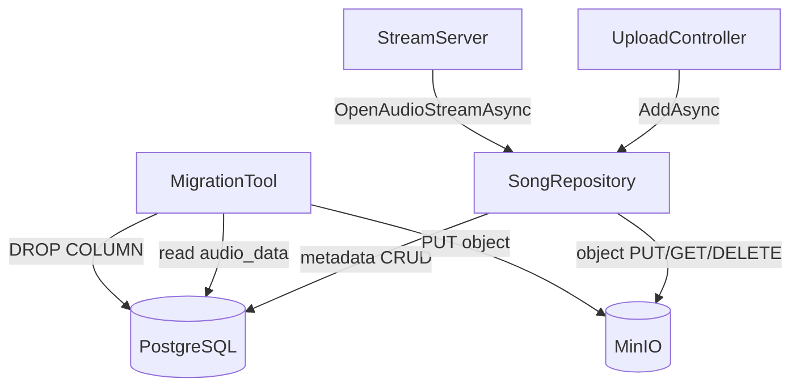

# Design Document: MinIO Music Storage

## Overview

This design migrates audio file storage in bndradio from PostgreSQL `BYTEA` columns to MinIO, an S3-compatible object storage service. The migration preserves the `ISongRepository` interface contract so that `StreamServer`, `UploadController`, and all other consumers require no changes beyond DI wiring.

The key architectural shift is: PostgreSQL becomes a pure metadata store (id, title, artist, duration_ms, play_count, file_hash), while MinIO holds all audio binary data as objects keyed by `songs/{song_id}`.

A one-time data migration utility reads existing `audio_data` bytes from PostgreSQL, uploads them to MinIO, and then drops the `audio_data` column.

## Architecture



**Startup sequence:**
1. Docker Compose starts MinIO, waits for its health check.
2. Docker Compose starts PostgreSQL, waits for its health check.
3. Backend starts, reads MinIO config from environment, creates `IAmazonS3` client, calls `EnsureSchemaAsync` (creates bucket if absent, runs SQL migrations).

**Dependency injection changes:**
- Add `IAmazonS3` (singleton) registered from `MinioOptions`.
- Replace `SongRepository` constructor: `NpgsqlDataSource` + `IAmazonS3` + `IOptions<MinioOptions>`.
- No changes to `ISongRepository` registration or any consumer.

## Components and Interfaces

### MinioOptions

A strongly-typed configuration POCO bound from `appsettings.json` / environment variables:

```csharp
public class MinioOptions
{
    public string Endpoint   { get; set; } = "localhost:9000";
    public string AccessKey  { get; set; } = "";
    public string SecretKey  { get; set; } = "";
    public string BucketName { get; set; } = "audio";
}
```

Bound via `builder.Services.Configure<MinioOptions>(builder.Configuration.GetSection("MinIO"))` and validated at startup.

### SongRepository (updated)

Constructor signature changes to:

```csharp
public SongRepository(
    NpgsqlDataSource dataSource,
    IAmazonS3 s3,
    IOptions<MinioOptions> minioOptions)
```

Key method changes:

| Method | Change |
|---|---|
| `AddAsync` | Upload stream to MinIO first; insert metadata row (no `audio_data`); rollback MinIO object on DB failure |
| `OpenAudioStreamAsync` | Call `s3.GetObjectAsync` with key `songs/{id}`; copy response stream to `MemoryStream`; throw `KeyNotFoundException` if object missing |
| `DeleteAsync` | Delete metadata row; delete MinIO object (ignore `NoSuchKey`) |
| `EnsureSchemaAsync` | Create bucket if absent; run SQL migrations (drop `audio_data` column) |

Object key format: `songs/{song_id}` (e.g., `songs/3fa85f64-5717-4562-b3fc-2c963f66afa6`).

### MigrationTool

A standalone .NET console project (`bndradio-migration`) or a startup-time routine that:
1. Reads all rows from `songs` where `audio_data IS NOT NULL`.
2. For each row, checks if the MinIO object `songs/{id}` already exists (HEAD request).
3. If absent, uploads `audio_data` bytes to MinIO.
4. After all rows are processed, drops the `audio_data` column.

The tool logs per-song success/failure and continues on individual upload errors (requirement 7.5).

### Docker Compose additions

```yaml
minio:
  image: minio/minio
  command: server /data --console-address ":9001"
  environment:
    MINIO_ROOT_USER: "${MINIO_ROOT_USER}"
    MINIO_ROOT_PASSWORD: "${MINIO_ROOT_PASSWORD}"
  ports:
    - "9000:9000"
    - "9001:9001"
  volumes:
    - minio_data:/data
  healthcheck:
    test: ["CMD", "curl", "-f", "http://localhost:9000/minio/health/live"]
    interval: 5s
    timeout: 5s
    retries: 10
```

The `backend` service gains `depends_on: minio: condition: service_healthy` and the four MinIO env vars.

## Data Models

### PostgreSQL `songs` table (post-migration)

```sql
CREATE TABLE songs (
    id          UUID    PRIMARY KEY DEFAULT gen_random_uuid(),
    title       TEXT    NOT NULL,
    artist      TEXT    NOT NULL,
    duration_ms INTEGER NOT NULL,
    play_count  INTEGER NOT NULL DEFAULT 0,
    file_hash   TEXT    NULL
    -- audio_data BYTEA column removed by migration
);
```

### MinIO object layout

| Field | Value |
|---|---|
| Bucket | `audio` (configurable via `MinIO:BucketName`) |
| Key | `songs/{song_id}` |
| Content-Type | `application/octet-stream` |
| Metadata | none required |

### SQL migration file

`migrations/002_remove_audio_data.sql`:

```sql
ALTER TABLE songs DROP COLUMN IF EXISTS audio_data;
```

`IF EXISTS` makes it idempotent (requirement 6.2).

### Configuration (`appsettings.json` additions)

```json
"MinIO": {
  "Endpoint":   "localhost:9000",
  "AccessKey":  "minioadmin",
  "SecretKey":  "minioadmin",
  "BucketName": "audio"
}
```

Environment variable overrides (mapped by ASP.NET Core convention):
`MINIO_ENDPOINT`, `MINIO_ACCESS_KEY`, `MINIO_SECRET_KEY`, `MINIO_BUCKET_NAME`
→ `MinIO:Endpoint`, `MinIO:AccessKey`, `MinIO:SecretKey`, `MinIO:BucketName`.

## Correctness Properties

*A property is a characteristic or behavior that should hold true across all valid executions of a system — essentially, a formal statement about what the system should do. Properties serve as the bridge between human-readable specifications and machine-verifiable correctness guarantees.*

### Property 1: Upload round-trip

*For any* valid audio stream, calling `AddAsync` and then `OpenAudioStreamAsync` with the returned song id should produce a stream whose bytes are identical to the original audio bytes.

**Validates: Requirements 3.1, 3.2, 4.1**

### Property 2: Upload atomicity — MinIO failure prevents metadata insert

*For any* `AddAsync` call where the MinIO upload fails, the PostgreSQL `songs` table should contain no new row for that song id.

**Validates: Requirements 3.3**

### Property 3: Upload atomicity — metadata failure triggers MinIO rollback

*For any* `AddAsync` call where the PostgreSQL insert fails after a successful MinIO upload, the MinIO object `songs/{song_id}` should not exist after the call returns.

**Validates: Requirements 3.4**

### Property 4: Delete is idempotent

*For any* song id, calling `DeleteAsync` twice should succeed without error, and neither the metadata row nor the MinIO object should exist after either call.

**Validates: Requirements 5.1, 5.2, 5.3**

### Property 5: Missing object raises KeyNotFoundException

*For any* song id that has a metadata row but no corresponding MinIO object, `OpenAudioStreamAsync` should throw `KeyNotFoundException`.

**Validates: Requirements 4.2**

### Property 6: SHA-256 hash consistency

*For any* audio byte array, the `file_hash` stored in PostgreSQL after `AddAsync` should equal the lowercase hex SHA-256 digest of those bytes.

**Validates: Requirements 3.5**

### Property 7: Bucket initialization is idempotent

*For any* number of calls to `EnsureSchemaAsync`, the bucket should exist and no exception should be thrown regardless of whether the bucket existed before the first call.

**Validates: Requirements 2.1, 2.2**

### Property 8: Schema migration is idempotent

*For any* database state (with or without the `audio_data` column), applying migration `002_remove_audio_data.sql` should leave the table without an `audio_data` column and complete without error.

**Validates: Requirements 6.1, 6.2**

### Property 9: Data migration skips already-migrated songs

*For any* set of songs where a subset already has MinIO objects, running the migration tool should upload only the songs that are absent from MinIO, leaving existing objects unchanged.

**Validates: Requirements 7.3**

### Property 10: Configuration validation at startup

*For any* backend startup where one or more required MinIO environment variables are absent, the application should throw `InvalidOperationException` before accepting any requests.

**Validates: Requirements 8.2**

### Property 11: Concurrent audio streams are independent

*For any* song id and any number of concurrent `OpenAudioStreamAsync` calls, each returned stream should independently produce the same correct bytes without corruption or interference.

**Validates: Requirements 4.3**

### Property 12: Migration continues past individual upload failures

*For any* set of songs where a subset fails to upload to MinIO, the migration tool should still attempt and complete uploads for all remaining songs.

**Validates: Requirements 7.5**

## Error Handling

| Scenario | Behavior |
|---|---|
| MinIO upload fails in `AddAsync` | Exception propagated; no DB row inserted |
| DB insert fails after MinIO upload | MinIO object deleted; exception propagated |
| MinIO object missing in `OpenAudioStreamAsync` | `KeyNotFoundException` thrown |
| MinIO object missing in `DeleteAsync` | Silently ignored (idempotent) |
| MinIO unreachable at startup | `EnsureSchemaAsync` throws; app fails to start |
| Missing MinIO env var at startup | `InvalidOperationException` with descriptive message |
| Migration tool upload failure for a song | Error logged; migration continues with remaining songs |

The `StreamServer` already has retry logic (`OpenWithRetryAsync`) that handles transient `OpenAudioStreamAsync` failures — no changes needed there.

## Testing Strategy

### Unit tests (xUnit)

Focus on specific examples, edge cases, and error conditions using fakes/mocks:

- `AddAsync` with a mock `IAmazonS3` that throws → verify no DB row inserted.
- `AddAsync` with a mock DB that throws after MinIO succeeds → verify MinIO delete called.
- `OpenAudioStreamAsync` with a mock returning `NoSuchKeyException` → verify `KeyNotFoundException`.
- `DeleteAsync` with a mock returning `NoSuchKeyException` → verify no exception thrown.
- `EnsureSchemaAsync` when bucket already exists → verify no exception.
- Startup validation: missing `MINIO_ENDPOINT` → `InvalidOperationException`.

### Property-based tests (FsCheck.Xunit — already in project)

Each property test runs a minimum of 100 iterations. Tests are tagged with the feature and property number.

**Property 1 — Upload round-trip**
```
// Feature: minio-music-storage, Property 1: Upload round-trip
// For any valid audio byte array, AddAsync then OpenAudioStreamAsync returns identical bytes
```
Uses an in-memory fake `IAmazonS3` (backed by `ConcurrentDictionary<string, byte[]>`) and an in-memory fake `NpgsqlDataSource` substitute, or an integration test against real MinIO + PostgreSQL containers.

**Property 4 — Delete is idempotent**
```
// Feature: minio-music-storage, Property 4: Delete is idempotent
// For any song id, two sequential DeleteAsync calls both succeed
```

**Property 6 — SHA-256 hash consistency**
```
// Feature: minio-music-storage, Property 6: SHA-256 hash consistency
// For any byte array, file_hash == lowercase hex SHA-256
```
Pure function test, no I/O needed.

**Property 7 — Bucket initialization is idempotent**
```
// Feature: minio-music-storage, Property 7: Bucket initialization is idempotent
// For any call count >= 1, EnsureSchemaAsync does not throw
```

**Property 8 — Schema migration is idempotent**
```
// Feature: minio-music-storage, Property 8: Schema migration is idempotent
// Applying 002_remove_audio_data.sql twice does not throw
```

**Property 9 — Data migration skips already-migrated songs**
```
// Feature: minio-music-storage, Property 9: Data migration skips already-migrated songs
// For any partition of songs into migrated/unmigrated, only unmigrated songs are uploaded
```

**Property 10 — Configuration validation at startup**
```
// Feature: minio-music-storage, Property 10: Configuration validation at startup
// For any combination of missing required MinIO env vars, startup throws InvalidOperationException
```

**Property 11 — Concurrent audio streams are independent**
```
// Feature: minio-music-storage, Property 11: Concurrent audio streams are independent
// For any song id, N concurrent OpenAudioStreamAsync calls each return identical correct bytes
```

**Property 12 — Migration continues past individual upload failures**
```
// Feature: minio-music-storage, Property 12: Migration continues past individual upload failures
// For any set of songs where a subset fails to upload, remaining songs are still attempted
```

### Integration tests

The existing `PreservationTests` use `WebApplicationFactory<Program>` against a real PostgreSQL instance. After this migration, those tests should continue to pass unchanged — they exercise `UploadController` and `ISongRepository` through the HTTP layer, which remains identical.

New integration tests should run against both a real PostgreSQL container and a real MinIO container (via Docker Compose or Testcontainers) to validate the full upload/stream/delete cycle end-to-end.
